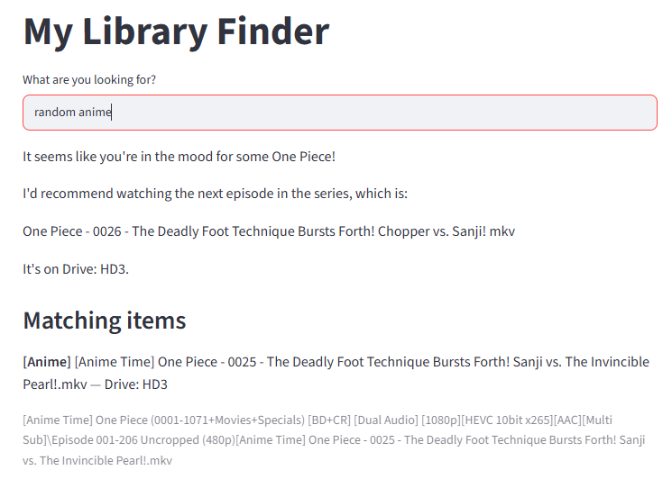

# File Finder

A natural-language search engine for a personal media library spread across 9 physical external hard drives (147,663 files and folders indexed). Ask it questions in plain English — "a funny movie for tonight," "where's my Dragon Ball anime" — and it finds and recommends real items from your own collection, with the exact drive and folder path. Runs entirely offline: no cloud APIs, no data ever leaves your machine.



## Setup

1. Clone the repo and open it in your terminal.

2. Create and activate a virtual environment:
```
   python -m venv venv
   venv\Scripts\activate
```

3. Install dependencies:
```
   pip install -r requirements.txt
```
   Note: this pulls in `torch` via `sentence-transformers` — it's a large download, expect it to take a few minutes.

4. Install [Ollama](https://ollama.com/download), then pull the local model:
```
   ollama pull llama3.2
```

5. Index your own library:
```
   python scan.py
   python build_database.py
   python categorize.py
   python build_embeddings.py
```
   Run `scan.py` once per drive you want indexed.

6. Run it:
```
   streamlit run app.py
```
   or, for a terminal-only version:
```
   python ask.py
```

## Built with

- Python 3.13
- SQLite
- sentence-transformers (all-MiniLM-L6-v2)
- Ollama (Llama 3.2)
- Streamlit
- NumPy
